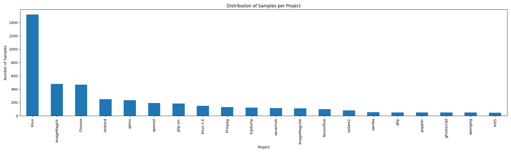
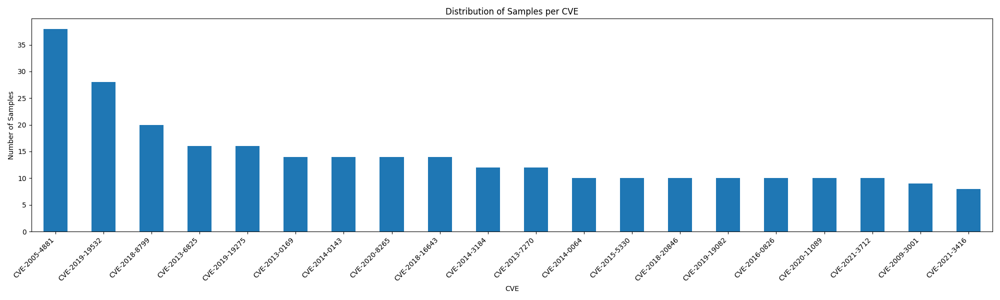

================================= primevul_train_paired.jsonl =============================
--------------------------------- DataFrame info ---------------------------------
<class 'pandas.core.frame.DataFrame'>
RangeIndex: 7578 entries, 0 to 7577
Data columns (total 15 columns):
 #   Column          Non-Null Count  Dtype  
---  ------          --------------  -----  
 0   idx             7578 non-null   int64  
 1   project         7578 non-null   object 
 2   commit_id       7578 non-null   object 
 3   project_url     7578 non-null   object 
 4   commit_url      7578 non-null   object 
 5   commit_message  7578 non-null   object 
 6   target          7578 non-null   int64  
 7   func            7578 non-null   object 
 8   func_hash       7578 non-null   object 
 9   file_name       7578 non-null   object 
 10  file_hash       4873 non-null   float64
 11  cwe             7578 non-null   object 
 12  cve             7578 non-null   object 
 13  cve_desc        7578 non-null   object 
 14  nvd_url         7578 non-null   object 
dtypes: float64(1), int64(2), object(12)
memory usage: 888.2+ KB
Samples: 7578
------------------------------------- Stats ----------------------------------------
Total samples:  7578
Unique cve_ids = 3266 (43.10%)
Unique projects = 545 (7.19%)
--------------------------------- Top 10 Projects ---------------------------------
https://github.com/torvalds/linux: 1519 samples
https://github.com/ImageMagick/ImageMagick: 478 samples
https://github.com/chromium/chromium: 468 samples
None: 251 samples
https://github.com/bonzini/qemu: 236 samples
https://github.com/openssl/openssl: 192 samples
https://github.com/php/php-src: 186 samples
http://git.kernel.org/?p=linux/kernel/git/torvalds/linux-2.6: 149 samples
https://github.com/FFmpeg/FFmpeg: 132 samples
https://github.com/the-tcpdump-group/tcpdump: 124 samples
--------------------------------- Distribution of Samples per Project ---------------------------------

--------------------------------- Distribution of Samples per CVE ---------------------------------

