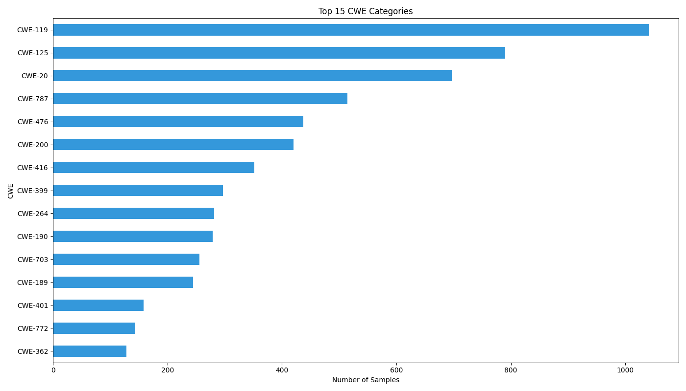
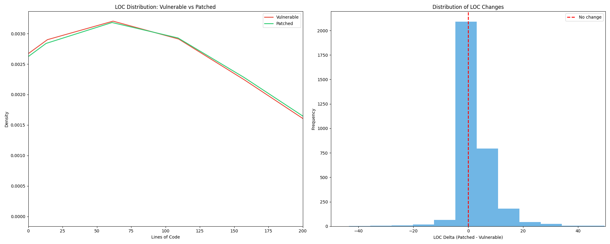

# PrimeVul Dataset Analysis Report

**Generated:** 2025-12-18 17:40:52

**Dataset:** primevul_train_paired.jsonl

---

## 1. Target Distribution Analysis

### Overview
- **Total samples:** 7578
- **Vulnerable (target=1):** 3789 (50.00%)
- **Patched (target=0):** 3789 (50.00%)

### Balance Ratio
- **Vulnerable:Patched ratio:** 1.000
- **Status:** ✅ Well-balanced (within 10% of 1:1)


## 2. Pairing Validation

### Pairing Statistics
- **Total CVEs:** 3266
- **Perfect pairs (1 vuln + 1 patch):** 2883 (88.27%)
- **CVEs with multiple versions:** 373 (11.42%)
- **CVEs with only vulnerable code:** 8 (0.24%)
- **CVEs with only patched code:** 2 (0.06%)

⚠️ **Warning:** 10 CVEs have incomplete pairs!

### CVEs with Multiple Versions (Top 10)

| cve            |   vuln_count |   patch_count |   total |
|:---------------|-------------:|--------------:|--------:|
| CVE-2005-4881  |           19 |            19 |      38 |
| CVE-2019-19532 |           14 |            14 |      28 |
| CVE-2018-8799  |           10 |            10 |      20 |
| CVE-2013-6825  |            8 |             8 |      16 |
| CVE-2019-19275 |            8 |             8 |      16 |
| CVE-2013-0169  |            7 |             7 |      14 |
| CVE-2014-0143  |            7 |             7 |      14 |
| CVE-2018-16643 |            7 |             7 |      14 |
| CVE-2020-8265  |            7 |             7 |      14 |
| CVE-2014-3184  |            6 |             6 |      12 |

### Consecutive Pairing Pattern
- **Consecutive pairs found:** 3772
- **Expected (total/2):** 3789
- **Match rate:** 99.55%

✅ **Dataset follows consecutive pairing pattern**

## 3. CWE Distribution Analysis

### Overview
- **Total CWE tags:** 7578
- **Unique CWE types:** 112
- **Samples with multiple CWEs:** 0 (0.00%)
- **Avg CWEs per sample:** 1.00

### Top 20 CWE Categories

| CWE     |   Count |   Percentage |
|:--------|--------:|-------------:|
| CWE-119 |    1041 |        13.74 |
| CWE-125 |     790 |        10.42 |
| CWE-20  |     697 |         9.2  |
| CWE-787 |     514 |         6.78 |
| CWE-476 |     437 |         5.77 |
| CWE-200 |     420 |         5.54 |
| CWE-416 |     352 |         4.65 |
| CWE-399 |     297 |         3.92 |
| CWE-264 |     282 |         3.72 |
| CWE-190 |     279 |         3.68 |
| CWE-703 |     256 |         3.38 |
| CWE-189 |     245 |         3.23 |
| CWE-401 |     158 |         2.08 |
| CWE-772 |     143 |         1.89 |
| CWE-362 |     128 |         1.69 |
| CWE-369 |     116 |         1.53 |
| CWE-310 |     104 |         1.37 |
| CWE-284 |     100 |         1.32 |
| CWE-415 |      98 |         1.29 |
| CWE-835 |      91 |         1.2  |



### Common CWE Categories Found

- **CWE-119** (Buffer Overflow): 1041 samples
- **CWE-120** (Buffer Copy without Checking Size): 70 samples
- **CWE-125** (Out-of-bounds Read): 790 samples
- **CWE-787** (Out-of-bounds Write): 514 samples
- **CWE-416** (Use After Free): 352 samples
- **CWE-476** (NULL Pointer Dereference): 437 samples
- **CWE-190** (Integer Overflow): 279 samples
- **CWE-189** (Numeric Errors): 245 samples
- **CWE-200** (Information Exposure): 420 samples
- **CWE-20** (Improper Input Validation): 697 samples
- **CWE-79** (Cross-site Scripting (XSS)): 32 samples
- **CWE-89** (SQL Injection): 8 samples
- **CWE-264** (Permissions/Privileges): 282 samples
- **CWE-310** (Cryptographic Issues): 104 samples
- **CWE-362** (Race Condition): 128 samples

## 4. Code Length Analysis

### Lines of Code Statistics

**Vulnerable Functions:**
- Mean: 152.55 lines
- Median: 63.00 lines
- Std Dev: 481.64
- Min: 2 lines
- Max: 23899 lines

**Patched Functions:**
- Mean: 155.60 lines
- Median: 67.00 lines
- Std Dev: 483.23
- Min: 1 lines
- Max: 24007 lines

### LOC Delta (Patched - Vulnerable)

- **Mean delta:** 3.13 lines
- **Median delta:** 2.00 lines
- **Patches that add code:** 2155 (66.19%)
- **Patches that remove code:** 329 (10.10%)
- **Patches with same LOC:** 772 (23.71%)



## 5. CWE by Project Analysis

### Top 10 Projects vs Top 10 CWEs

Crosstab showing vulnerability type distribution across major projects:

| project     |   CWE-119 |   CWE-125 |   CWE-190 |   CWE-20 |   CWE-200 |   CWE-264 |   CWE-399 |   CWE-416 |   CWE-476 |   CWE-787 |
|:------------|----------:|----------:|----------:|---------:|----------:|----------:|----------:|----------:|----------:|----------:|
| Android     |        65 |        12 |         6 |       24 |        38 |        52 |         2 |         0 |         2 |         4 |
| Chrome      |        76 |         8 |        10 |      108 |        24 |        34 |        64 |        34 |         0 |         4 |
| FFmpeg      |        34 |        18 |         0 |       10 |         2 |         0 |         6 |         2 |        18 |        12 |
| ImageMagick |        50 |        54 |        34 |       38 |         8 |         0 |        19 |        22 |        20 |        21 |
| linux       |       170 |        54 |        21 |      128 |       125 |        84 |        72 |       159 |        91 |        79 |
| linux-2.6   |        12 |         0 |         6 |       10 |        57 |        16 |        14 |         0 |         6 |         0 |
| openssl     |        16 |        14 |         2 |        9 |        14 |         0 |        13 |         0 |        20 |         8 |
| php-src     |        42 |        26 |        10 |       16 |         6 |         6 |         4 |        10 |        10 |        10 |
| qemu        |        38 |        14 |        22 |       32 |         6 |         4 |        17 |         2 |         6 |        22 |
| tcpdump     |         2 |       110 |         0 |        2 |         0 |         0 |         0 |         0 |         0 |         0 |

### Dominant CWE per Project

| Project     |   Total_Samples | Top_CWE   |   Top_CWE_Count | Top_CWE_Pct   |
|:------------|----------------:|:----------|----------------:|:--------------|
| linux       |            1519 | CWE-119   |             170 | 11.2%         |
| ImageMagick |             478 | CWE-772   |              79 | 16.5%         |
| Chrome      |             468 | CWE-20    |             108 | 23.1%         |
| Android     |             251 | CWE-119   |              65 | 25.9%         |
| qemu        |             236 | CWE-119   |              38 | 16.1%         |
| openssl     |             192 | CWE-310   |              42 | 21.9%         |
| php-src     |             186 | CWE-119   |              42 | 22.6%         |
| linux-2.6   |             149 | CWE-200   |              57 | 38.3%         |
| FFmpeg      |             132 | CWE-119   |              34 | 25.8%         |
| tcpdump     |             124 | CWE-125   |             110 | 88.7%         |


## 6. Code Pattern Analysis

### Vulnerable Code Patterns

Patterns found in vulnerable functions:

| Pattern        |   Count | Percentage   |
|:---------------|--------:|:-------------|
| pointer_deref  |    3110 | 82.08%       |
| array_access   |    2271 | 59.94%       |
| memcpy_call    |     524 | 13.83%       |
| free_call      |     297 | 7.84%        |
| malloc_call    |     235 | 6.20%        |
| unsafe_strcpy  |      78 | 2.06%        |
| unsafe_sprintf |      57 | 1.50%        |
| unsafe_strcat  |      24 | 0.63%        |
| unsafe_gets    |       0 | 0.00%        |

### Patch/Fix Patterns

Patterns found in patched functions:

| Pattern       |   Count | Percentage   |
|:--------------|--------:|:-------------|
| size_check    |    3051 | 80.52%       |
| bounds_check  |    2119 | 55.93%       |
| return_check  |     596 | 15.73%       |
| null_check    |     302 | 7.97%        |
| safe_snprintf |     126 | 3.33%        |
| safe_strncpy  |      63 | 1.66%        |
| safe_strncat  |       6 | 0.16%        |


## 7. Function Completeness Analysis

### Completeness Statistics

- **Complete functions:** 6144 (81.08%)
- **Incomplete/snippets:** 1434 (18.92%)

### Completeness by Target

**Vulnerable functions:**
- Complete: 3058/3789 (80.71%)

**Patched functions:**
- Complete: 3086/3789 (81.45%)

### Paired Completeness

- **CVEs with both functions complete:** 2623/3266 (80.31%)
- **Suitable for Coming analysis:** 2623 pairs

✅ **Most pairs have complete functions, suitable for Coming analysis.**

### Examples of Incomplete Functions

**CVE:** CVE-2011-4128, **Target:** 1
```
gnutls_session_get_data (gnutls_session_t session,                          void *session_data, size_t * session_data_size) {    gnutls_datum_t psession;   int ret;    if (session->internals.resumable...
```

**CVE:** CVE-2011-4128, **Target:** 0
```
gnutls_session_get_data (gnutls_session_t session,                          void *session_data, size_t * session_data_size) {    gnutls_datum_t psession;   int ret;    if (session->internals.resumable...
```

**CVE:** CVE-2011-4128, **Target:** 1
```
gnutls_session_get_data (gnutls_session_t session,                          void *session_data, size_t * session_data_size) {    gnutls_datum_t psession;   int ret;    if (session->internals.resumable...
```

## 8. Research Recommendations: Causal & Probabilistic Inference

Based on the comprehensive analysis, here's a research framework using causal inference and probabilistic methods:

### 🎯 Causal Research Questions

#### 1. **Treatment Effect Estimation**

**Question:** Do specific code changes causally reduce vulnerabilities?

**Treatments to investigate:**
- Adding bounds checks (`if (size < MAX_SIZE)`)
- Replacing unsafe functions (strcpy → strncpy)
- Adding NULL pointer checks
- Adding error handling (return value checks)

**Methodology:**
- **Propensity Score Matching**: Match similar vulnerable functions, compare those that received treatment vs control
- **Doubly Robust Estimation**: Combine outcome regression + inverse probability weighting
- **Sensitivity Analysis**: Test robustness to unmeasured confounding using E-values

**Expected Output:** Average Treatment Effect (ATE) with 95% confidence intervals

#### 2. **Heterogeneous Treatment Effects**

**Question:** Which types of code benefit most from specific fixes?

**Analysis:**
- **Causal Forests**: Estimate individual treatment effects τ(x) = E[Y(1) - Y(0) | X=x]
- **Subgroup Analysis**: Identify effect modifiers (project type, code complexity, CWE category)

**Priority CWEs for heterogeneity analysis:**
1. CWE-119: 1041 samples
2. CWE-125: 790 samples
3. CWE-20: 697 samples

**Research Value:** Discover that bounds checks are highly effective for CWE-119 but ineffective for CWE-310

#### 3. **Counterfactual Reasoning**

**Question:** What would have happened if a different fix was applied?

**Scenarios:**
- If CVE-X used strncpy instead of adding bounds check?
- If complex refactoring was replaced with minimal fix?

**Methods:**
- **Structural Causal Models (SCM)**: Build causal DAG
- **do-calculus**: Compute P(Y | do(T=t), X) interventional distributions
- **Bayesian Networks**: Posterior predictive checks

### 📊 Probabilistic Inference Framework

#### 1. **Bayesian Hierarchical Models**

**Structure:**
```
Level 1 (CVE): Vulnerability characteristics
Level 2 (Project): Project-specific effects
Level 3 (CWE): Vulnerability type effects
```

**Benefits:**
- Partial pooling: Share information across groups
- Full posterior distributions (not just point estimates)
- Natural uncertainty quantification
- Handle missing data elegantly

**Implementation:** PyMC, Stan, or NumPyro

#### 2. **Causal Discovery**

**Question:** What is the causal structure among code features?

**Methods:**
- **PC Algorithm**: Constraint-based causal discovery
- **GES Algorithm**: Score-based structure learning
- **NOTEARS**: Continuous optimization for DAG learning

**Output:** Causal DAG showing:
- Code complexity → Fix strategy selection
- Project type → Vulnerability prevalence
- CWE category → Required fix type

#### 3. **Bayesian Causal Inference**

**Advantages over frequentist approaches:**
- Prior knowledge incorporation (e.g., security best practices)
- Credible intervals (direct probability statements)
- Posterior predictive checks for model validation
- Sequential updating as more data arrives

**Example Research Question:**
*"Given that a function has 200+ LOC and uses malloc, what is the probability that adding a bounds check will fix the vulnerability?"*

### 🔬 Recommended Analysis Pipeline

#### **Phase 1: Feature Extraction (Week 1)**

1. Extract treatment indicators from code pairs:
   - Added bounds checks
   - Replaced unsafe functions
   - Added NULL checks
   - Modified loop bounds

2. Extract confounders (pre-treatment covariates):
   - Function complexity (LOC, cyclomatic complexity)
   - Code patterns (pointer usage, array access)
   - Project characteristics
   - CWE category

3. Define outcomes:
   - Primary: Vulnerability fixed (binary)
   - Secondary: Code complexity change, maintainability

#### **Phase 2: Causal Estimation (Week 2-3)**

With 2623 complete pairs:

1. **Propensity Score Analysis**
   - Estimate P(Treatment=1 | Confounders)
   - Match treated/control units
   - Compute ATE: E[Y(1)] - E[Y(0)]

2. **Doubly Robust Estimation**
   - Fit outcome model: E[Y | T, X]
   - Fit propensity model: P(T | X)
   - Combine for robust ATE estimate

3. **Sensitivity Analysis**
   - Rosenbaum bounds for hidden bias
   - E-values for unmeasured confounding
   - Test: How strong must confounder be to invalidate results?

#### **Phase 3: Heterogeneity Analysis (Week 4)**

1. **Causal Forests**
   - Estimate τ(x) for each unit
   - Identify subgroups with large/small effects
   - Feature importance for effect modification

2. **Subgroup Analysis by:**
   - CWE category (does treatment work differently for buffer overflows vs crypto bugs?)
   - Project (Linux kernel vs ImageMagick)
   - Code complexity (simple vs complex functions)

#### **Phase 4: Bayesian Inference (Week 5-6)**

1. **Build Structural Causal Model**
   - Define causal DAG
   - Specify prior distributions
   - Fit using MCMC (PyMC/Stan)

2. **Posterior Analysis**
   - Full treatment effect distribution
   - Probability of positive effect
   - Credible intervals
   - Posterior predictive checks

3. **Causal Discovery**
   - Learn causal structure from data
   - Validate against domain knowledge
   - Generate hypotheses for future research

### 📈 Concrete Research Hypotheses

**H1: Causal Effect of Bounds Checks on Buffer Overflows**
- Null: ATE = 0 (no effect)
- Alternative: ATE > 0 (bounds checks causally reduce vulnerabilities)
- Method: Doubly robust estimation with sensitivity analysis
- Sample: Filter to CWE-119 (buffer overflow) cases

**H2: Heterogeneous Effects by Project Type**
- Null: τ(x) constant across projects
- Alternative: Treatment effects vary by project
- Method: Causal forests with project as moderator
- Insight: Identify which projects benefit most from specific fixes

**H3: Mediating Role of Code Complexity**
- Question: Does fix type → complexity change → vulnerability reduction?
- Method: Mediation analysis
- Output: Direct vs indirect effects

**H4: Optimal Fix Strategy per CWE**
- Question: What is P(Fix Type | CWE, Code Features)?
- Method: Bayesian hierarchical model
- Output: Posterior predictive distribution for fix recommendation

### 🛠️ Required Tools & Libraries

**Causal Inference:**
```python
pip install econml dowhy causalml
pip install scikit-learn scipy
```

**Bayesian Inference:**
```python
pip install pymc arviz bambi
pip install jax numpyro  # Alternative: faster sampling
```

**Causal Discovery:**
```python
pip install causal-learn pgmpy
pip install networkx graphviz  # For visualization
```

### ⚠️ Key Considerations

**Identification Assumptions:**
1. **Conditional Independence**: (Y(0), Y(1)) ⊥ T | X (no unmeasured confounding)
2. **Positivity**: 0 < P(T=1|X) < 1 (all units have non-zero probability of treatment)
3. **SUTVA**: No interference between units, one version of treatment

**Validation Strategies:**
- **Placebo tests**: Apply methods to known null effects
- **Cross-validation**: Split data, validate on holdout
- **Sensitivity analysis**: Test robustness to violations
- **Domain expertise**: Consult security researchers

**Potential Challenges:**
- **Incomplete functions** (1434 samples): May need full context for accurate feature extraction
- **Multiple versions per CVE** (373 CVEs): Need to decide which pairs to use
- **Selection bias**: Dataset may over-represent certain project types or CWE categories
- **Unmeasured confounding**: Developer experience, code review practices not in data

### 🎓 Expected Contributions

**Methodological:**
- First causal analysis of vulnerability fix patterns
- Bayesian framework for fix recommendation
- Heterogeneous treatment effect estimation for security

**Practical:**
- Evidence-based fix recommendations ("For CWE-119 in Linux kernel, bounds checks reduce risk by X%")
- Identify ineffective fix patterns to avoid
- Uncertainty quantification for security decisions

**Theoretical:**
- Causal mechanisms underlying vulnerability introduction/removal
- Learned causal DAG of code → vulnerability relationships
- Taxonomy of fix archetypes with causal interpretations

### 🚀 Next Steps

**This Week:**
1. Install causal inference libraries (econml, dowhy, pymc)
2. Create feature extraction pipeline (treatments, confounders, outcomes)
3. Select pilot dataset: 100-200 CWE-119 (buffer overflow) pairs
4. Test propensity score matching on pilot

**Next 2 Weeks:**
5. Implement doubly robust estimation
6. Run sensitivity analysis (E-values, Rosenbaum bounds)
7. Estimate heterogeneous effects with causal forests
8. Visualize results (effect distributions, subgroup comparisons)

**Month 2:**
9. Build Bayesian hierarchical model
10. Perform causal discovery (learn DAG structure)
11. Apply to multiple CWE categories
12. Write up findings with causal interpretation

---

*Causal inference research plan generated on 2025-12-18 17:40:58*

**Key Insight:** Unlike standard ML approaches that ask *"what predicts vulnerabilities?"*, causal inference asks *"what changes CAUSE vulnerability reduction?"* - providing actionable guidance for developers.
