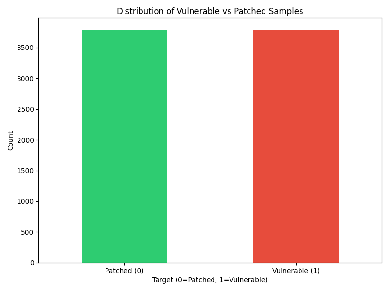
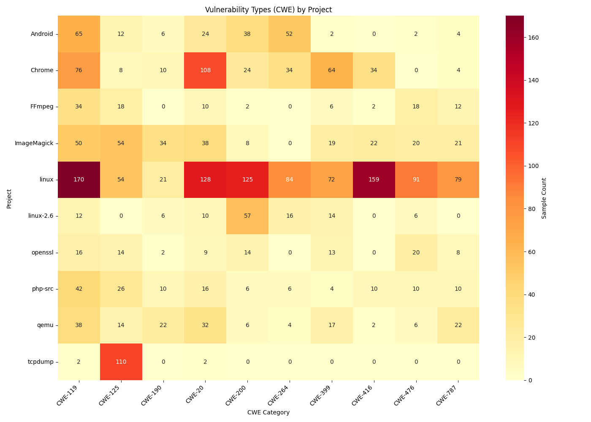
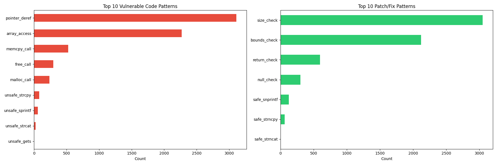

# PrimeVul Dataset Analysis Report

**Generated:** 2025-12-18 15:32:38

**Dataset:** primevul_train_paired.jsonl

---

## 1. Target Distribution Analysis

### Overview
- **Total samples:** 7578
- **Vulnerable (target=1):** 3789 (50.00%)
- **Patched (target=0):** 3789 (50.00%)

### Balance Ratio
- **Vulnerable:Patched ratio:** 1.000
- **Status:** ✅ Well-balanced (within 10% of 1:1)



## 2. Pairing Validation

### Pairing Statistics
- **Total CVEs:** 3266
- **Perfect pairs (1 vuln + 1 patch):** 2883 (88.27%)
- **CVEs with multiple versions:** 373 (11.42%)
- **CVEs with only vulnerable code:** 8 (0.24%)
- **CVEs with only patched code:** 2 (0.06%)

⚠️ **Warning:** 10 CVEs have incomplete pairs!

### CVEs with Multiple Versions (Top 10)

| cve            |   vuln_count |   patch_count |   total |
|:---------------|-------------:|--------------:|--------:|
| CVE-2005-4881  |           19 |            19 |      38 |
| CVE-2019-19532 |           14 |            14 |      28 |
| CVE-2018-8799  |           10 |            10 |      20 |
| CVE-2013-6825  |            8 |             8 |      16 |
| CVE-2019-19275 |            8 |             8 |      16 |
| CVE-2013-0169  |            7 |             7 |      14 |
| CVE-2014-0143  |            7 |             7 |      14 |
| CVE-2018-16643 |            7 |             7 |      14 |
| CVE-2020-8265  |            7 |             7 |      14 |
| CVE-2014-3184  |            6 |             6 |      12 |

### Consecutive Pairing Pattern
- **Consecutive pairs found:** 3772
- **Expected (total/2):** 3789
- **Match rate:** 99.55%

✅ **Dataset follows consecutive pairing pattern**

## 3. CWE Distribution Analysis

### Overview
- **Total CWE tags:** 7578
- **Unique CWE types:** 112
- **Samples with multiple CWEs:** 0 (0.00%)
- **Avg CWEs per sample:** 1.00

### Top 20 CWE Categories

| CWE     |   Count |   Percentage |
|:--------|--------:|-------------:|
| CWE-119 |    1041 |        13.74 |
| CWE-125 |     790 |        10.42 |
| CWE-20  |     697 |         9.2  |
| CWE-787 |     514 |         6.78 |
| CWE-476 |     437 |         5.77 |
| CWE-200 |     420 |         5.54 |
| CWE-416 |     352 |         4.65 |
| CWE-399 |     297 |         3.92 |
| CWE-264 |     282 |         3.72 |
| CWE-190 |     279 |         3.68 |
| CWE-703 |     256 |         3.38 |
| CWE-189 |     245 |         3.23 |
| CWE-401 |     158 |         2.08 |
| CWE-772 |     143 |         1.89 |
| CWE-362 |     128 |         1.69 |
| CWE-369 |     116 |         1.53 |
| CWE-310 |     104 |         1.37 |
| CWE-284 |     100 |         1.32 |
| CWE-415 |      98 |         1.29 |
| CWE-835 |      91 |         1.2  |


### Common CWE Categories Found

- **CWE-119** (Buffer Overflow): 1041 samples
- **CWE-120** (Buffer Copy without Checking Size): 70 samples
- **CWE-125** (Out-of-bounds Read): 790 samples
- **CWE-787** (Out-of-bounds Write): 514 samples
- **CWE-416** (Use After Free): 352 samples
- **CWE-476** (NULL Pointer Dereference): 437 samples
- **CWE-190** (Integer Overflow): 279 samples
- **CWE-189** (Numeric Errors): 245 samples
- **CWE-200** (Information Exposure): 420 samples
- **CWE-20** (Improper Input Validation): 697 samples
- **CWE-79** (Cross-site Scripting (XSS)): 32 samples
- **CWE-89** (SQL Injection): 8 samples
- **CWE-264** (Permissions/Privileges): 282 samples
- **CWE-310** (Cryptographic Issues): 104 samples
- **CWE-362** (Race Condition): 128 samples

## 4. Code Length Analysis

### Lines of Code Statistics

**Vulnerable Functions:**
- Mean: 152.55 lines
- Median: 63.00 lines
- Std Dev: 481.64
- Min: 2 lines
- Max: 23899 lines

**Patched Functions:**
- Mean: 155.60 lines
- Median: 67.00 lines
- Std Dev: 483.23
- Min: 1 lines
- Max: 24007 lines

### LOC Delta (Patched - Vulnerable)

- **Mean delta:** 3.13 lines
- **Median delta:** 2.00 lines
- **Patches that add code:** 2155 (66.19%)
- **Patches that remove code:** 329 (10.10%)
- **Patches with same LOC:** 772 (23.71%)


## 5. CWE by Project Analysis

### Top 10 Projects vs Top 10 CWEs

Crosstab showing vulnerability type distribution across major projects:

| project     |   CWE-119 |   CWE-125 |   CWE-190 |   CWE-20 |   CWE-200 |   CWE-264 |   CWE-399 |   CWE-416 |   CWE-476 |   CWE-787 |
|:------------|----------:|----------:|----------:|---------:|----------:|----------:|----------:|----------:|----------:|----------:|
| Android     |        65 |        12 |         6 |       24 |        38 |        52 |         2 |         0 |         2 |         4 |
| Chrome      |        76 |         8 |        10 |      108 |        24 |        34 |        64 |        34 |         0 |         4 |
| FFmpeg      |        34 |        18 |         0 |       10 |         2 |         0 |         6 |         2 |        18 |        12 |
| ImageMagick |        50 |        54 |        34 |       38 |         8 |         0 |        19 |        22 |        20 |        21 |
| linux       |       170 |        54 |        21 |      128 |       125 |        84 |        72 |       159 |        91 |        79 |
| linux-2.6   |        12 |         0 |         6 |       10 |        57 |        16 |        14 |         0 |         6 |         0 |
| openssl     |        16 |        14 |         2 |        9 |        14 |         0 |        13 |         0 |        20 |         8 |
| php-src     |        42 |        26 |        10 |       16 |         6 |         6 |         4 |        10 |        10 |        10 |
| qemu        |        38 |        14 |        22 |       32 |         6 |         4 |        17 |         2 |         6 |        22 |
| tcpdump     |         2 |       110 |         0 |        2 |         0 |         0 |         0 |         0 |         0 |         0 |

### Dominant CWE per Project

| Project     |   Total_Samples | Top_CWE   |   Top_CWE_Count | Top_CWE_Pct   |
|:------------|----------------:|:----------|----------------:|:--------------|
| linux       |            1519 | CWE-119   |             170 | 11.2%         |
| ImageMagick |             478 | CWE-772   |              79 | 16.5%         |
| Chrome      |             468 | CWE-20    |             108 | 23.1%         |
| Android     |             251 | CWE-119   |              65 | 25.9%         |
| qemu        |             236 | CWE-119   |              38 | 16.1%         |
| openssl     |             192 | CWE-310   |              42 | 21.9%         |
| php-src     |             186 | CWE-119   |              42 | 22.6%         |
| linux-2.6   |             149 | CWE-200   |              57 | 38.3%         |
| FFmpeg      |             132 | CWE-119   |              34 | 25.8%         |
| tcpdump     |             124 | CWE-125   |             110 | 88.7%         |



## 6. Code Pattern Analysis

### Vulnerable Code Patterns

Patterns found in vulnerable functions:

| Pattern        |   Count | Percentage   |
|:---------------|--------:|:-------------|
| pointer_deref  |    3110 | 82.08%       |
| array_access   |    2271 | 59.94%       |
| memcpy_call    |     524 | 13.83%       |
| free_call      |     297 | 7.84%        |
| malloc_call    |     235 | 6.20%        |
| unsafe_strcpy  |      78 | 2.06%        |
| unsafe_sprintf |      57 | 1.50%        |
| unsafe_strcat  |      24 | 0.63%        |
| unsafe_gets    |       0 | 0.00%        |

### Patch/Fix Patterns

Patterns found in patched functions:

| Pattern       |   Count | Percentage   |
|:--------------|--------:|:-------------|
| size_check    |    3051 | 80.52%       |
| bounds_check  |    2119 | 55.93%       |
| return_check  |     596 | 15.73%       |
| null_check    |     302 | 7.97%        |
| safe_snprintf |     126 | 3.33%        |
| safe_strncpy  |      63 | 1.66%        |
| safe_strncat  |       6 | 0.16%        |



## 7. Function Completeness Analysis

### Completeness Statistics

- **Complete functions:** 6144 (81.08%)
- **Incomplete/snippets:** 1434 (18.92%)

### Completeness by Target

**Vulnerable functions:**
- Complete: 3058/3789 (80.71%)

**Patched functions:**
- Complete: 3086/3789 (81.45%)

### Paired Completeness

- **CVEs with both functions complete:** 2623/3266 (80.31%)
- **Suitable for Coming analysis:** 2623 pairs

✅ **Most pairs have complete functions, suitable for Coming analysis.**

### Examples of Incomplete Functions

**CVE:** CVE-2011-4128, **Target:** 1
```
gnutls_session_get_data (gnutls_session_t session,                          void *session_data, size_t * session_data_size) {    gnutls_datum_t psession;   int ret;    if (session->internals.resumable...
```

**CVE:** CVE-2011-4128, **Target:** 0
```
gnutls_session_get_data (gnutls_session_t session,                          void *session_data, size_t * session_data_size) {    gnutls_datum_t psession;   int ret;    if (session->internals.resumable...
```

**CVE:** CVE-2011-4128, **Target:** 1
```
gnutls_session_get_data (gnutls_session_t session,                          void *session_data, size_t * session_data_size) {    gnutls_datum_t psession;   int ret;    if (session->internals.resumable...
```

## 8. Research Recommendations

Based on the comprehensive analysis above, here are actionable recommendations for your vulnerability research:

### 🎯 Priority Research Directions

#### 1. Focus on High-Impact CWE Categories

The dataset is dominated by these vulnerability types:

1. **CWE-119**: 1041 samples - Start Coming analysis here
2. **CWE-125**: 790 samples - Start Coming analysis here
3. **CWE-20**: 697 samples - Start Coming analysis here

#### 2. Project-Specific Analysis

Major projects like **Linux kernel**, **ImageMagick**, and **Chromium** have sufficient samples (>100) for statistical significance. Consider:
- Building project-specific vulnerability profiles
- Comparing fix patterns across projects for same CWE
- Identifying project-specific coding practices that reduce vulnerabilities

#### 3. Code Change Pattern Mining

With **2623 complete function pairs**, you can:
- Use Coming to extract AST-level change patterns
- Build a taxonomy of security fix types
- Train ML models to predict fix strategies

### 🛠️ Coming Tool Strategy

#### Recommended Pipeline:

1. **Pilot Study (Week 1-2)**
   - Select 100 samples from CWE-119 (buffer overflow)
   - Convert to Coming format (`diff_N/func_s.c` and `func_t.c`)
   - Run pattern mining: `coming -mode mineinstance -action INS -entitytype BinaryOperator`
   - Validate that Coming produces meaningful patterns

2. **Scaling Up (Week 3-4)**
   - Process all 2623 complete pairs
   - Extract features using `coming -mode features`
   - Build CWE-specific pattern libraries

3. **Analysis & Modeling (Week 5+)**
   - Cluster similar fix patterns
   - Build predictive models (vulnerability type → expected fix pattern)
   - Cross-validate on test set

### 📊 Predictive Modeling Opportunities

#### Research Questions You Can Answer:

1. **Pattern Discovery**
   - What are the 10 most common AST change patterns in security fixes?
   - Do different CWE categories have distinct fix signatures?

2. **Vulnerability Prediction**
   - Can code features predict vulnerability type (CWE classification)?
   - Which code metrics correlate with vulnerability severity?

3. **Fix Quality Analysis**
   - Do minimal fixes (few LOC changes) differ in effectiveness from refactorings?
   - What's the relationship between fix complexity and vulnerability recurrence?

4. **Causal Inference**
   - Do bounds checks **causally** reduce buffer overflows? (use propensity score matching)
   - What code change patterns **cause** vulnerabilities vs fix them?

### ⚠️ Data Quality Considerations

**Known issues to address:**

- 10 CVEs with unpaired data - exclude from paired analysis
- 2705 samples missing file_hash - cannot retrieve full context

### 🚀 Next Steps

**Immediate (This Week):**
1. Create `src/primevul_analysis/converter.py` to convert PrimeVul → Coming format
2. Select pilot subset: 100 CWE-119 pairs
3. Test Coming integration with pilot data

**Short-term (Next 2 Weeks):**
4. Process full dataset through Coming
5. Build pattern frequency database
6. Create visualization dashboard (Jupyter widgets or Streamlit)

**Medium-term (Month 2):**
7. Extract ML features from Coming output
8. Train baseline classifiers (RandomForest, XGBoost)
9. Implement causal inference pipeline
10. Write preliminary findings report

---

*Analysis complete. Report generated on 2025-12-18 15:37:50*
